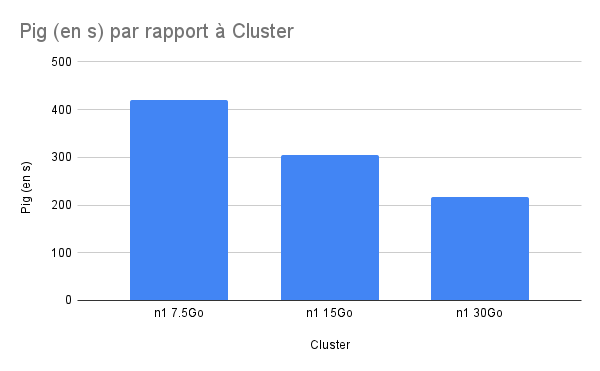
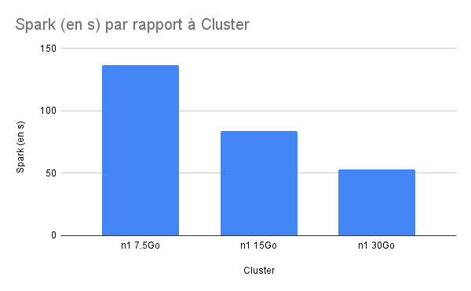
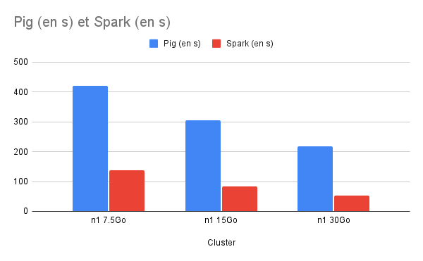

# Introduction
Ce projet a pour but de comparer la vitesse d'exécution d'un algorithme PageRank implémenté en Pig et SPARK avec des clusters de tailles différentes.

Il nous fallait tout d'abord trouver un crawl pour notre expérience. Nous avons récupérer ue partie d'un crawl de Wikipédia que nous avons ensuite traité pour qu'il convienne à nos besoins.
On se retrouve donc avec un crawl de forme {url; {url_cible1, url_cible2, ...}

Le crawl est un peu plus léger que ce que nous avions prévu car nous avons manqué de temps pour réaliser l'expérience sur un crawl plus conséquent.

Lien du crawl: https://drive.google.com/file/d/1D-mAZJhzAJNzCJrsXK0Ap7hBQKyCmRs4/view?usp=sharing

Expérience réalisé par Nathan ROCHETEAU et Gildas LE MOGUEDEC

# Déroulement de l'expérience
## Bucket
On créer un nouveau bucket pour notre expérience.
La première chose à faire est d'importer les fichiers qui nous seront utiles.
On importe donc:
- Le script pig: **pagerank_init.pig** et **pagerank.pig**
- Le script SPARK: **pagerank_spark.py**
- Le crawl: *Voir plus haut*

## Clusters
Il faut construire les clusters qui nous serviront pour l'expérience depuis l'onglet DataProc.
Nous avons choisit d'utiliser des configurations de clusters prédéfinies:
- 2 workers N1-2 standard avec 2 processeurs virtuels et 7.5 Go de mémoire
- 2 workers N1-4 standard avec 4 precesseurs virtuels et 15 Go de mémoire
- 2 workers N1-8 standard avec 8 processeurs virtuels et 30 Go de mémoire

## Pig
### Exécution
Il faut maintenant exécuter le script Pig. On initialise d'abord les données avec le script **pagerank_init.pig** puis on lance l'algorithme de Pagerank avec le script **pagerank.pig**.
Pour cela on utilise les commandes:
- gcloud dataproc jobs submit pig --cluster=[**Nom_du_cluster**] --region=europe-west1 --file=gs://[**Nom_du_bucket**]/pagerank_init.pig
- gcloud dataproc jobs submit pig --cluster=[**Nom_du_cluster**] --region=europe-west1 --file=gs://[**Nom_du_bucket**]/pagerank.pig

On utilise alors tout les différents clusters pour comparer les temps d'exécution.

### Résultats
Comme nous nous y attendions Pig est relativement long mais nous pouvons cependant bien voir l'évolution  du temps selon les clusters qui évoluent.

## Spark
### Exécution
Pour effectuer notre Pagerank en Spark nous effectuons la commande suivantes:
- gcloud dataproc jobs submit pyspark --cluster=cluster-n13 --region=europe-west1 gs://[**Nom_du_bucket**]/pagerank_spark.py -- gs://[**Nom_du_bucket**]/crawl.csv [**Nb_d'itérations**]

### Résultats
On peut noter que l'éxecution du Spark est grandement handicapée par l'écriture (qui n'est pas optimisé du tout dans notre script) dans le fichier. En effet, on peut avoir un temps d'exécution bien inférieur (jusqu'à un 10 fois moins long) mais nous avons préféré conserver le temps d'écriture des données car on voit bien l'impact des clusters plus performants.

# Conclusion
Malgré notre soucis d'optimisation d'écriture du script Spark, on peut voir que Spark est bien plus performant que Pig. De plus 

